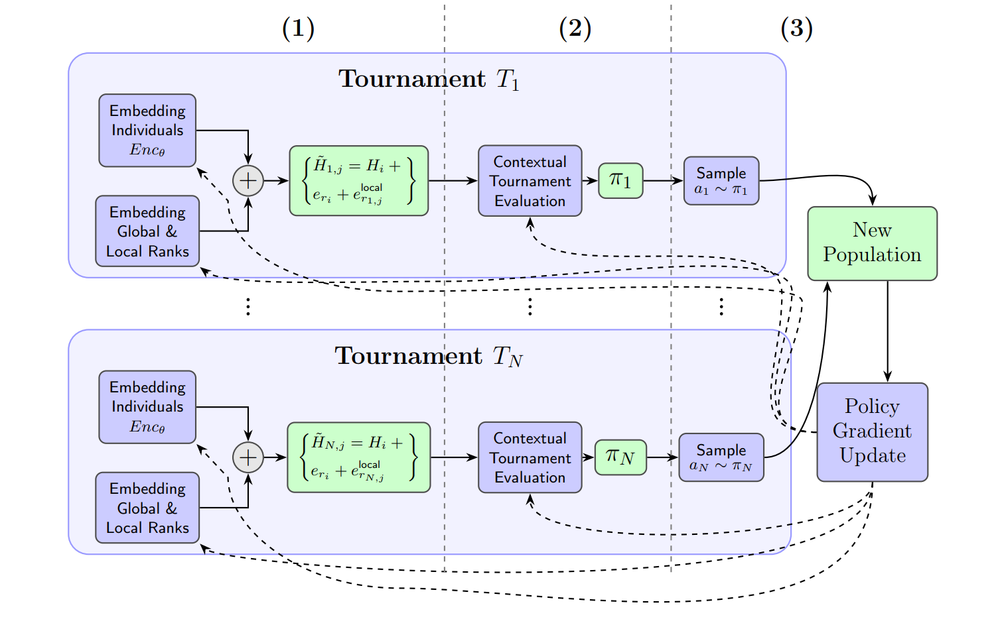

# Deep Tournament Selection (DTS) for Genetic Algorithms

Implementation of the paper **"Deep Tournament Selection for Genetic Algorithms"**
(Eliad Shem-Tov, Ron Edri, Achiya Elyasaf — Ben-Gurion University of the Negev).
📄 **Paper:** _link coming soon_.

Implemented as EC-KitY adapter (`selection/eckity_adapter.py`).

<p align="center">
  
</p>

## Repository layout

```
deep_tournament_selection/
  selection/            # DTS operator + EC-KitY adapter + the neural networks
    eckity_adapter.py   #   DeepTournamentSelection(SelectionMethod)  <-- the glue
    dts_policy.py, population_to_vec_transformer.py, self_attention_pointer.py, ...
  caching_evaluator.py  # persistent fitness cache (ports the original GA's fitness_dict)
  problems/             # EC-KitY evaluators + loaders + custom operators + bundled instances
    tsp.py, graph_coloring.py, set_cover.py, operators.py, data/
  experiments/          # per-problem runners + shared helpers
    tsp.py, graph_coloring.py, set_cover.py, common.py, runner_utils.py
  config.py             # paper hyperparameters
  logging_utils.py      # per-generation JSON statistics
run_experiments.py      # single entry point to sweep all problems x instances x runs
figures/                # fitness / diversity plots from the paper
images/                 # architecture diagrams
```

## Benchmark domains from the paper

| Domain             | Encoding                          | Instances                     |
| ------------------ | --------------------------------- | ----------------------------- |
| **Graph Coloring** | integer vector (color per vertex) | DIMACS, 96–450 vertices       |
| **Set Cover**      | bit vector (subset selected)      | OR-Library, 1000/2000 subsets |
| **TSP**            | permutation (tour order)          | TSPLIB, 48–1291 cities        |


All are framed as maximization (fitness = negated cost), matching DTS. Instance files are bundled
under `deep_tournament_selection/problems/data/`.

## Install

```bash
pip install -e .          # or: pip install -r requirements.txt
```
Requires Python 3.9+, PyTorch, numpy, eckity, overrides.

## Usage

Each problem has its own runner; swap DTS for the tournament baseline with `--selection tournament`.
Defaults follow the paper (pop 100, 6000 gens for GC/SC, 1000 for TSP); use flags for a quick run:

```bash
# quick single-instance runs
python -m deep_tournament_selection.experiments.graph_coloring --instance queen8_12.col.txt --generations 200
python -m deep_tournament_selection.experiments.set_cover      --instance scp41.txt        --generations 200
python -m deep_tournament_selection.experiments.tsp            --instance att48.tsp         --generations 200

# baseline comparison on the same setup
python -m deep_tournament_selection.experiments.tsp --instance att48.tsp --generations 200 --selection tournament

# sweep everything (all problems by default; paper protocol uses --runs 15)
python run_experiments.py --selection both --runs 3 --generations 500
```

Common flags: `--instance <file|all>`, `--selection dts|tournament`, `--population-size`,
`--generations`, `--runs`, `--crossover-prob`, `--mutation-prob`, `--output`, `--device`, `--quiet`,
`--no-diversity`.

**Results are saved locally** by the `FileLogger`, one JSON per run under `--output` (default
`runs/`):

```
runs/<problem>/<instance>/<selection>/run_<k>.json   # per-generation metrics
runs/summary.csv                                      # best-of-run table (run_experiments.py only)
```

Each `run_<k>.json` holds per-generation arrays: `mean`, `std`, `median`, `max` (best), `min`
(worst), `time` (seconds/generation), and `population_diversity` (domain-specific; disable with
`--no-diversity`).

### Using DTS in your own EC-KitY experiment

```python
from deep_tournament_selection.experiments.common import build_dts_operator

dts = build_dts_operator(population_size=100, vocab_size=2)  # vocab_size = max gene value + 1
# ... inside your Subpopulation:
selection_methods=[(dts, 1)]
```

## Fitness cache

EC-KitY re-evaluates every individual every generation. To preserve the original GA's
cross-generation fitness cache (skip recomputing already-scored genotypes — elites, unchanged
clones), wrap your evaluator in `CachingEvaluator` (the runners do this by default):

```python
from deep_tournament_selection import CachingEvaluator
evaluator = CachingEvaluator(MyEvaluator())
print(evaluator.cache_stats())   # {'hits': ..., 'misses': ..., 'hit_rate': ...}
```

## Results figures

The paper's fitness and population-diversity plots are in [`figures/`](figures/)
(`fitness_graph_dts_all_domains.pdf`, per-domain plots, and `hamming_distance_all_domains.pdf`).

## Citation

> **Note:** the paper has not been published yet. A citation (BibTeX) will be added here once it is
> available.

Paper: *Deep Tournament Selection for Genetic Algorithms* — Eliad Shem-Tov, Ron Edri, Achiya Elyasaf
(Ben-Gurion University of the Negev).

## License

Released under the **BSD 3-Clause License** — see [LICENSE](LICENSE).
